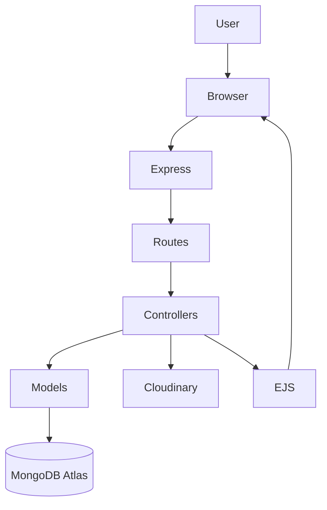
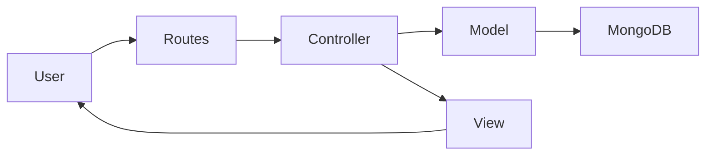
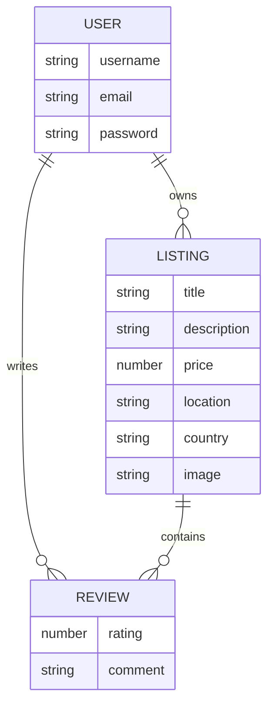
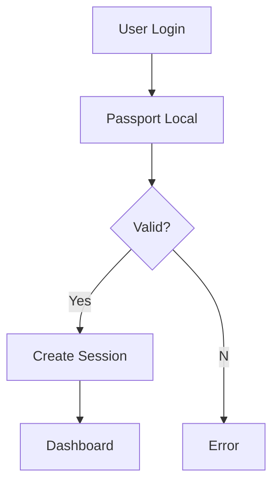
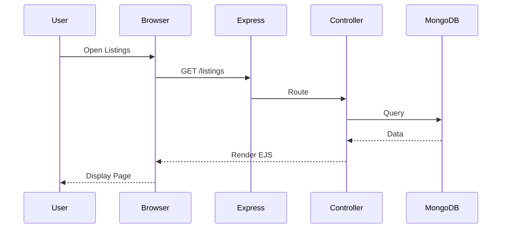
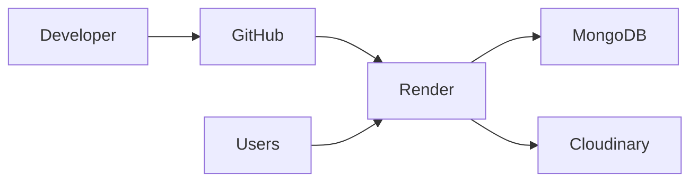

# 🌍 WonderLust

<p align="center">
  
  
  
  
  
</p>

<h3 align="center">An Airbnb-inspired Full Stack Accommodation Booking Platform</h3>

<p align="center">
<a href="https://majorproject-7z8l.onrender.com/listings"><strong>🚀 Live Demo</strong></a> •
<a href="https://github.com/sandeepkumaryadav05/majorproject"><strong>💻 Repository</strong></a>
</p>

---

# ✨ About

WonderLust is a production-style full-stack web application inspired by Airbnb. Users can browse properties, create listings, upload images, authenticate securely, and review accommodations. The project follows the MVC architecture and demonstrates modern backend development practices.

---

# ✨ Features

- 🔐 Authentication & Authorization
- 🏠 Property Listing Management (CRUD)
- ☁️ Cloudinary Image Upload
- ⭐ Ratings & Reviews
- 📍 Location Details
- 🛡️ Joi Validation
- 📱 Responsive Bootstrap UI
- ⚡ Session Management
- 🧩 MVC Architecture
- 🌐 RESTful Routing

---

# 🛠 Tech Stack

| Category | Technologies |
|----------|--------------|
| Frontend | HTML5, CSS3, Bootstrap, JavaScript, EJS |
| Backend | Node.js, Express.js |
| Database | MongoDB Atlas, Mongoose |
| Authentication | Passport.js, Express Session |
| Cloud | Cloudinary |
| Deployment | Render |

---

# 🏛 Project Architecture



# 🏗 MVC Flow



# 🗄 ER Diagram



# 🔐 Authentication Flow



# 🌐 Request Lifecycle



# 🚀 Deployment



# 📂 Folder Structure

```text
majorproject/
├── controllers/
├── models/
├── routes/
├── views/
├── public/
├── middleware.js
├── utils/
├── init/
├── app.js
└── package.json
```

# ⚙ Installation

```bash
git clone https://github.com/sandeepkumaryadav05/majorproject.git
cd majorproject
npm install
```

Create a `.env` file:

```env
ATLASDB_URL=
SECRET=
CLOUD_NAME=
CLOUD_API_KEY=
CLOUD_API_SECRET=
```

Run:

```bash
npm start
```

---

# 📸 Screenshots

Replace these placeholders after uploading images.

| Home | Listing |
|------|---------|
|  |  |

| Login | Create Listing |
|------|----------------|
|  |  |

---

# 🎯 Learning Outcomes

- MVC Architecture
- REST APIs
- CRUD Operations
- Authentication
- MongoDB Relationships
- Cloudinary Integration
- Session Management
- Deployment on Render

---

# 🔮 Future Enhancements

- 💳 Payment Gateway
- ❤️ Wishlist
- 🗺 Google Maps
- 🔍 Advanced Search
- 📅 Booking Calendar
- 📧 Email Verification
- 👤 User Profiles
- 🛠 Admin Dashboard

---

# 🤝 Contributing

Contributions, issues, and feature requests are welcome. Feel free to fork the repository and submit a pull request.

---

# 👨‍💻 Author

**Sandeep Kumar Yadav**

- GitHub: https://github.com/sandeepkumaryadav05
- LinkedIn: https://www.linkedin.com/in/sandeepkumaryadav05/

---

# ⭐ Support

If you found this project helpful, consider giving it a ⭐ on GitHub.

---

# 📄 License

This project is licensed under the MIT License.
